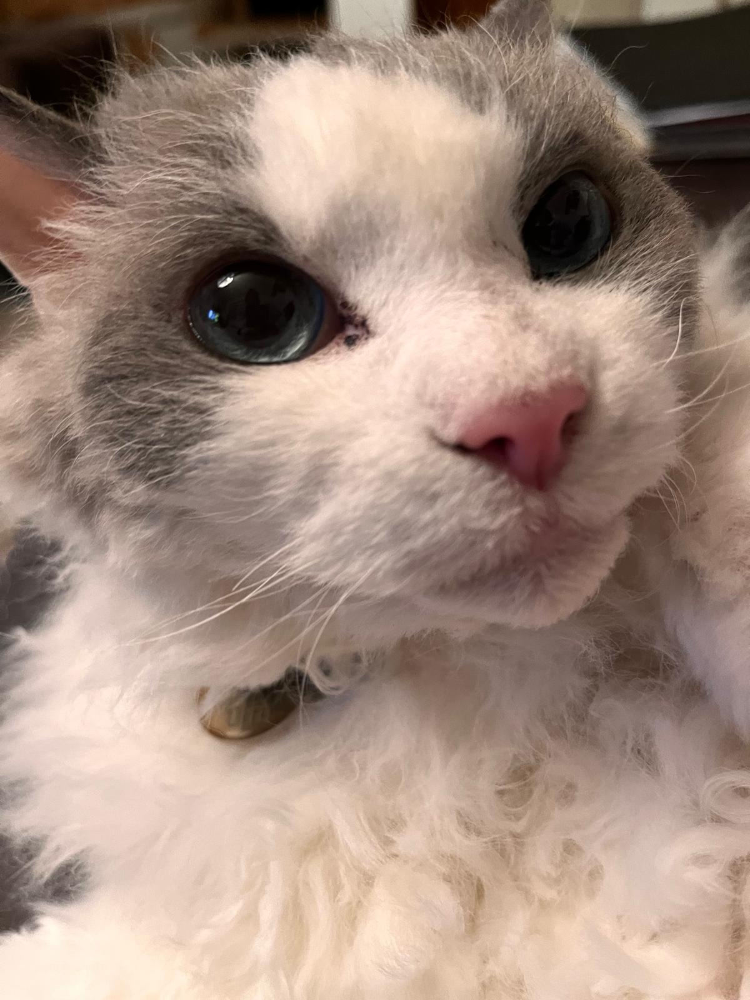
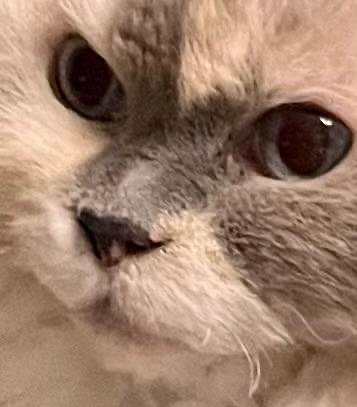
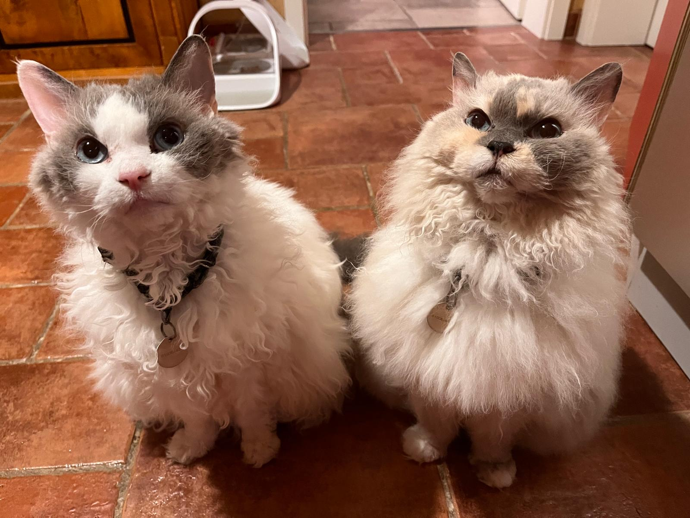
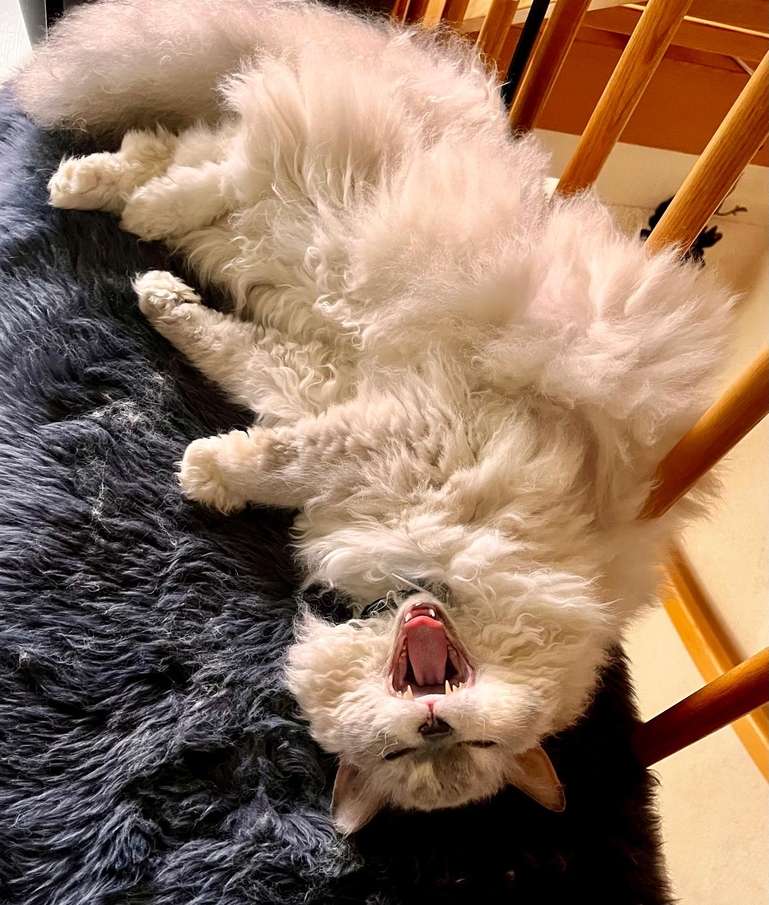
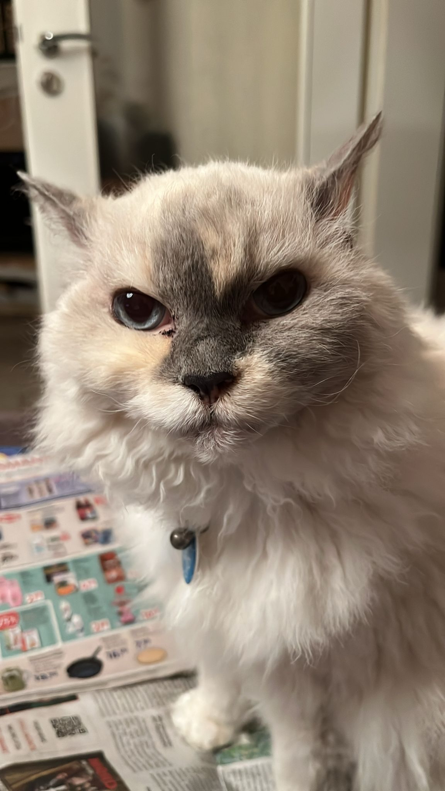
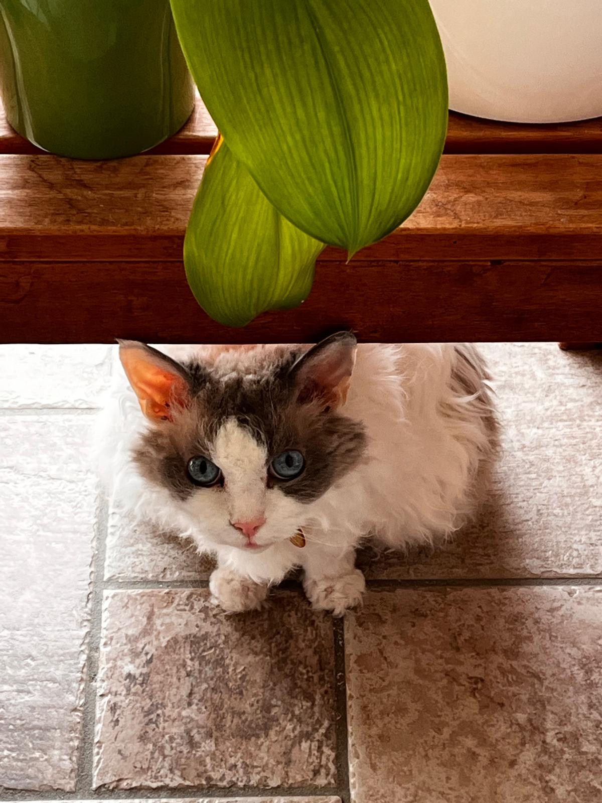
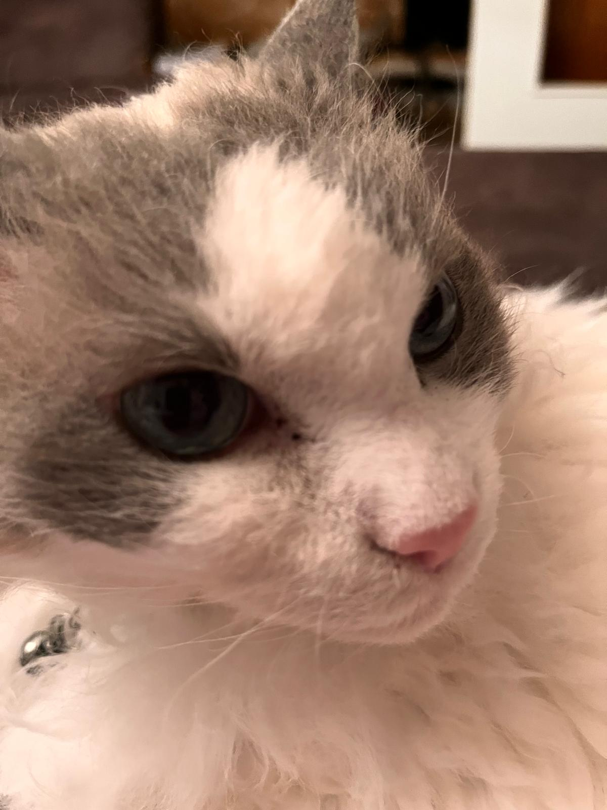
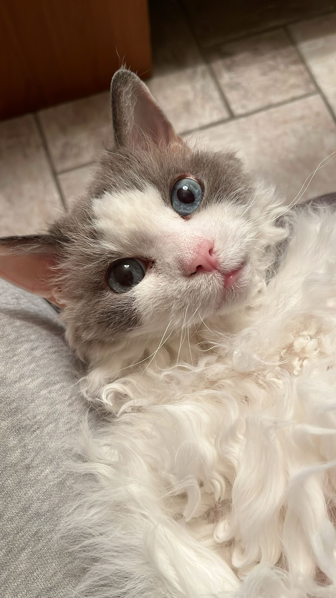
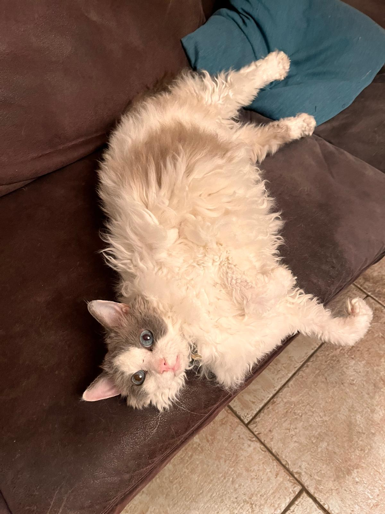
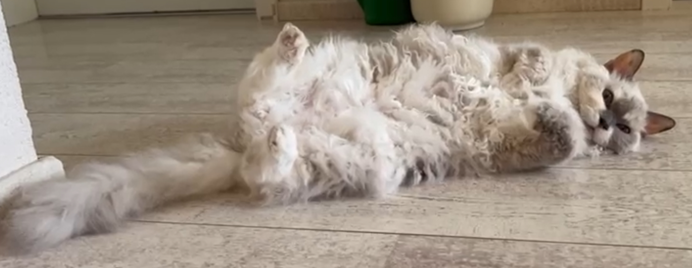

# Meow Meeeeow Meow #

Meow Meooow Meow Meeow Meeeow Meoow Meow Meoow Meow

Meowww Meeeow Meow Meeeow Meow Meeow Meow, Meeow, Meooow, Meow Meeow.

---

## Meoow Meeow Meow Meoww ##

- Meeow Meeow Meow [Meoww](https://en.wikipedia.org/wiki/Cat)
- Meow Meooww Meow Meoowww Meow Meeow Meow
(Meow Meow Meeow Meow > Meow Meow Meow)
- Meow Meow Meow Meow Meow Meeow Meow Meow Meow Meow
- Meoowww Meow Meow Meeow Meow Meow Meow Meeow Meow Meow Meow
- Meeow Meow Meow Meow Meow Meow Meow Meeow Meow Meow Meow Meow Meow Meow
- Meow Meeow Meow Meoww Meow Meow
(Meow Meeow Meoww Meeow)

---

Translation:

## My GitHub Profile ##

I am currently in my first year of vocational training

and really enjoy learning Python, HTML, CSS, Markdown and so on.

## About Me ##

- I really like [cats](https://en.wikipedia.org/wiki/Cat)
- I play Yu-Gi-Oh

(Yu-Gi-Oh > Magic)

- I really enjoy learning about coding, Git and GitHub
- I spend too much money on trying to pull Quarter Centuries
- Pineapple on Pizza is based and i am tired of pretending that it's not
- fuck you, if you disagree with me
(and if you play stun)

now time for some cats!

how about some more

and more

and even more

have some more cats

another one

and another one

and another one

More!

MORE!

MOOOOOOOOOOOOORE!!!

